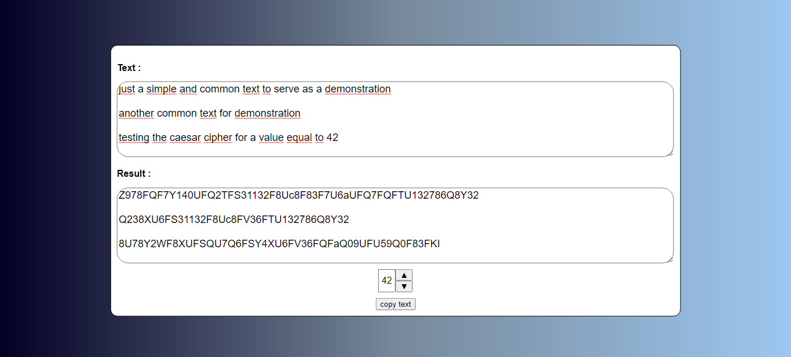

# 

  <h1>Simple Caesar-cipher-in-js-with-ReactJs</h1>
  <h6>by <i>FranciscoCharles</i></h6>

an example to learn about **React hooks** and an implementation of the Caesar cipher for didactic purposes.

    

# **Version**
- current version of the project: 1.0.

# **License**

For more information on the license for this project read the <a href="./LICENSE" title="go to license file">LICENSE</a> file.

---

    Copyright © 2021 <b>FranciscoCharles</b>

